# Software Architecture Document - questionnaire-voting-machine

## 1. Introduction and goals

**Intent.** Questionnaire Voting Machine is a workshop-ready web product that helps a Workshop Facilitator, Designers, and Design Leads capture a balanced AI competency snapshot. Designers complete timed self-assessments, Design Leads assess Assigned Designers from an observer perspective, and the system compares the two sides to produce category gaps, combined scores, maturity levels, and constructive recommendations. The architecture must stay small enough for an SDLC workshop while preserving the privacy, scoring, and explainability boundaries that make the product credible.

**Top-3 quality goals:**

1. **Workshop responsiveness under live usage** - answer saves, scoring, and dashboards must feel immediate while about 50 participants use the system.
2. **Role-scoped confidentiality** - personal assessment data and Lead assessment results must be visible only to the right role and never leak into presentation mode.
3. **Explainable, constructive scoring** - scores, gaps, maturity levels, and recommendations must be reproducible from recorded answers and use non-punitive language.

**Stakeholders.**

| Role | Interest | Sign-off owner? |
|---|---|---|
| Designer | Completes the self-assessment and receives a constructive completion experience. | No |
| Design Lead | Reviews Assigned Designers and compares observed competency with self-assessment. | No |
| Workshop Facilitator | Configures the Questionnaire, presents results, and protects demo privacy. | Yes |
| Tech Lead | Owns architecture, implementation boundaries, and SAD approval. | Yes |
| Security Lead | Reviews role visibility, assessment confidentiality, and demo data exposure. | Yes |

**Decision override.** A Vite + React single-page prototype with in-memory mock data exists in `src/` as a workshop visual demo. This SAD deliberately targets a different production stack - a hybrid Next.js full-stack application with Prisma-managed relational persistence and server-side scoring (ADR-0002 through ADR-0004) - rather than re-aligning the architecture to the prototype's Vite-SPA, no-backend shape. The prototype is treated as throwaway visual reference; production code is built fresh from the scaffold and is not migrated incrementally from the prototype. The prototype-to-production divergence is tracked as a risk in §11.

## 2. Constraints

**Technical.**
- The repository contains a standalone Vite + React + TypeScript single-page prototype (`src/`, `package.json`, `vite.config.ts`, `index.html`) built as a workshop visual demo backed by in-memory mock data (`src/data/mockData.ts`). There is no backend handler layer, persistence layer, database schema, or persisted `docs/architecture-map.md`. This prototype is a non-production visual reference, not the production scaffold this SAD targets - see the §1 decision-override note.
- The implementation target is a full-stack TypeScript web application following the workshop brief: React/Next.js-style web frontend, server-owned backend handlers, Prisma-managed relational persistence, local SQLite for workshop development, and a PostgreSQL-compatible path for a production-like demo.
- Concrete runtime versions must be pinned during project scaffold before the first implementation task; this SAD intentionally avoids inventing package versions that are not present in the repo.
- Scores, gaps, maturity levels, and recommendations are calculated on the backend from recorded responses and published scoring rules; browser-supplied scores are ignored.
- No external AI provider is required for the MVP. Recommendations are generated from controlled rule templates so the constructive tone can be reviewed.

**Organisational.**
- Feature size is M: the feature introduces a new web product surface, backend contracts, persistence, dashboard flows, scoring, and a workshop demo path.
- Delivery is optimized for a guided workshop vertical slice, not a production SaaS launch.
- The MVP should support the workshop targets in the spec: at least 50 active assessment sessions and scoring/dashboard checks for a cohort of 100 Designers.
- Product open questions in `spec.md` §8 must be resolved before their named downstream stage or dry-run checkpoint.

**Conventions.**
- `docs/features/questionnaire-voting-machine/spec.md` is the canonical product behavior source, and `CONTEXT.md` is the canonical glossary for role and domain names.
- Acceptance criteria use product-level Given/When/Then language; endpoint paths, schema fields, and migrations are owned by later `api` and `data-model` stages.
- User-facing result copy must use constructive terms such as "growth area", "recommended focus", and "next learning step".
- Domain modules should keep scoring functions pure and separately testable, with UI and server handlers calling into application services rather than duplicating business rules.

**Regulatory / external.**
- Assessment answers, lead comments, scores, maturity levels, and recommendations are confidential workplace development data, not payment or health data.
- Workshop demos should use fictional Designers or anonymized summaries unless the Security Lead approves named data for that setting.
- Lead assessment results are hidden from Designers unless the Workshop Facilitator explicitly enables that visibility.
- The MVP does not include full authentication, HR integrations, LMS integrations, or proctoring.

## 3. Context and scope

Questionnaire Voting Machine sits inside a workshop/demo environment and is used directly by three roles: Designer, Design Lead, and Workshop Facilitator. The system owns questionnaire setup, assessment sessions, scoring, comparisons, dashboards, and the presentation-friendly results view. External enterprise systems are intentionally out of scope for the MVP so the workshop can focus on the assessment domain and SDLC artifacts.

<!-- brownfield: N/A - greenfield code repo; no source tree or persisted architecture map exists yet. -->

**External systems (in / out):**

| Actor or system | Type | Interaction |
|---|---|---|
| Designer | Person | Opens a personal assessment experience, answers timed questions, and receives completion confirmation. |
| Design Lead | Person | Opens Assigned Designers, completes Lead assessment, and reviews comparison when available. |
| Workshop Facilitator | Person | Configures Questionnaires, views Team dashboard, and opens presentation-friendly results. |
| Tech Lead | Person | Reviews architecture and implementation boundaries. |
| Security Lead | Person | Reviews confidential data handling, demo privacy, and role visibility. |
| Enterprise HR / LMS / Slack systems | External systems | Out of scope for MVP; no integration in this design. |

**C4 Context (L1):**

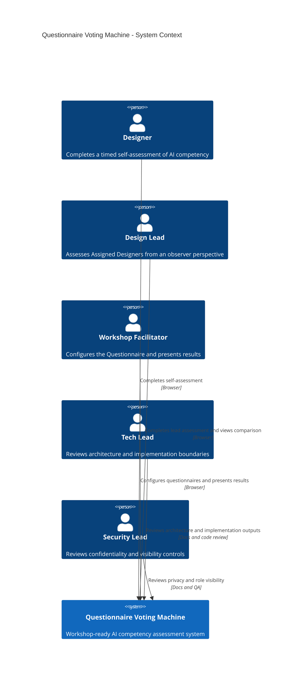

In prose: the Context view keeps the system as one product boundary. Designers, Design Leads, and the Workshop Facilitator interact through the browser; Tech Lead and Security Lead interact through review and QA. Enterprise systems are intentionally absent from the diagram because the MVP does not integrate with them.

## 4. Solution strategy

1. **Build backend-service and web-frontend surfaces** - The feature owns both the browser experience and the backend behavior that calculates scores, enforces access, stores responses, and exposes results. This declares `target_surfaces: [backend-service, web-frontend]` and lets downstream stages generate backend contracts plus UI-driven flows and tests. See ADR-0001.

2. **Use a hybrid full-stack web architecture** - The product is demoed and used in a browser, but the most sensitive behavior belongs on the server. A hybrid Next.js-style architecture keeps page delivery, server handlers, and route-level data loading close enough for workshop speed while still separating UI, application services, domain logic, and persistence. See ADR-0002.

3. **Use relational persistence with versioned assessment records** - Questionnaires, categories, questions, answer options, sessions, responses, scores, and recommendations are naturally relational and need traceable relationships. Published Questionnaires become immutable versions for active sessions so later edits do not corrupt historical scoring. See ADR-0003 and ADR-0006.

4. **Make scoring and recommendations server-owned** - The browser records answers and timing signals, but the backend calculates category scores, self-scores, lead-scores, combined scores, gaps, maturity levels, and constructive recommendations. This supports tamper resistance, reproducibility, and copy review. See ADR-0004 and ADR-0007.

5. **Use lightweight workshop access boundaries** - The MVP avoids full enterprise authentication, but it still needs role-scoped visibility. Personal assessment links, facilitator-seeded lead assignments, and server-side access checks protect personal detail while keeping the workshop teachable. See ADR-0005.

## 5. Building block view

The planned implementation uses a modular layered style inside one full-stack web application. UI routes/components call server handlers; server handlers call application services; application services coordinate domain rules and persistence adapters. This keeps the workshop implementation compact while preventing scoring, authorization, and timing rules from being copied into UI components.

**Planned internal decomposition:**

```text
src/
├── app/
│   ├── assessment/          self and lead assessment routes
│   ├── designers/           Designer list, profile, and comparison routes
│   ├── questionnaires/      facilitator setup routes
│   ├── dashboard/           Team dashboard route
│   └── present/             presentation-friendly results view
├── modules/
│   ├── access/              role/link checks and Assigned Designer visibility
│   ├── assessment/          session lifecycle, timers, response submission
│   ├── dashboard/           team summaries, trends, and presentation projection
│   ├── questionnaire/       categories, questions, options, publication
│   ├── recommendation/      constructive rule-template recommendations
│   └── scoring/             pure score, gap, and maturity calculations
├── persistence/             Prisma schema, repositories, migrations, seed data
├── ui/                      shared UI components and copy-safe display helpers
└── tests/                   unit, integration, contract, component, and e2e tests
```

**C4 Container (L2):**

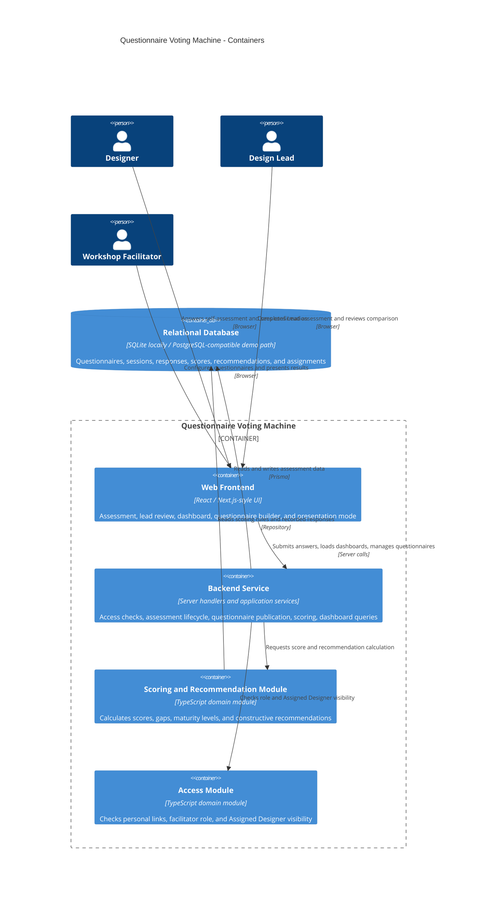

In prose: the Container view shows two declared target surfaces: `web-frontend` and `backend-service`. The database is not a target surface; it is the persistence container that the later data-model stage owns. Scoring and access are shown as logical containers because their rules are shared across several flows and must not be duplicated in the UI.

## 6. Runtime view

The design stage seeds the two most important flows. The later `sequences` stage should expand these into AC-by-AC coverage, including validation and authorization branches.

**Critical flow 1: Designer completes self-assessment**

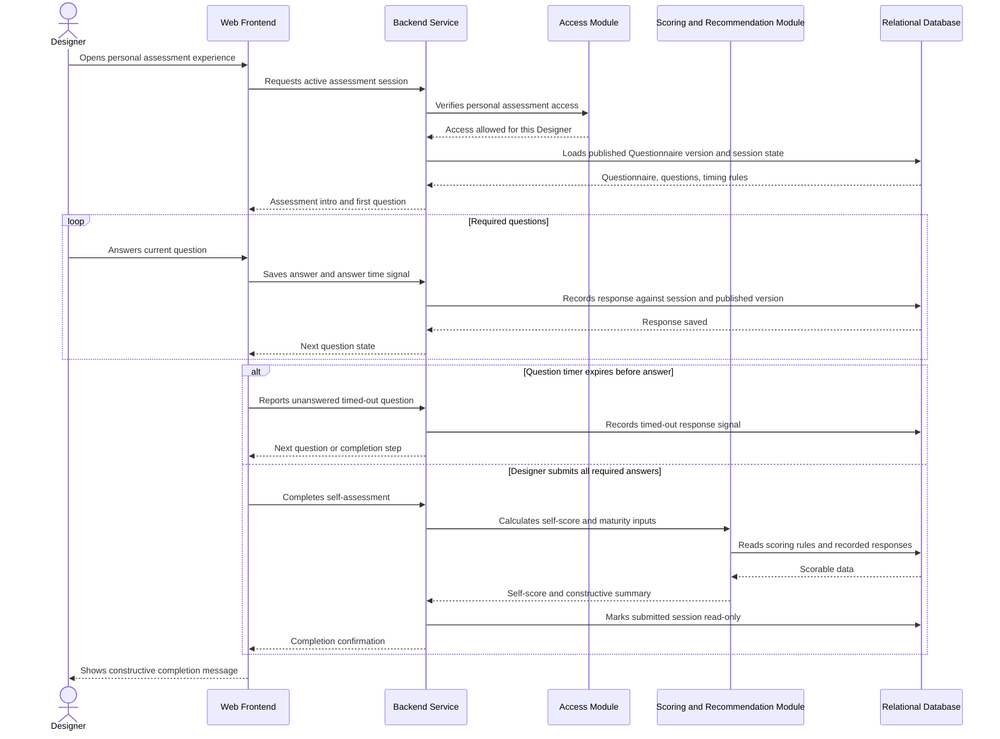

**Critical flow 2: Design Lead completes observer assessment and comparison becomes available**

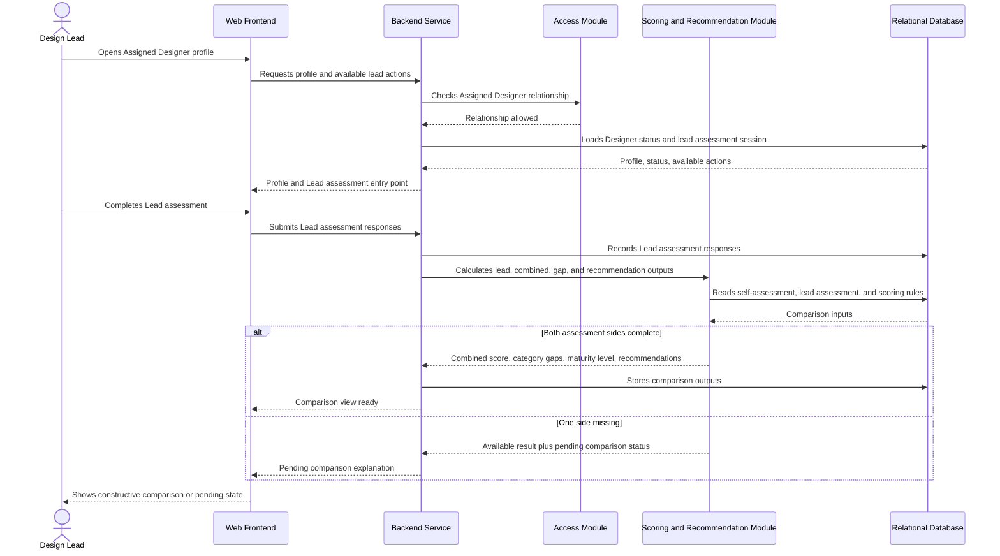

The following `sequences` stage blocks are the generic-participant runtime view used by downstream SDD stages. The design-stage seed diagrams above remain as architecture context.

### Open self-assessment

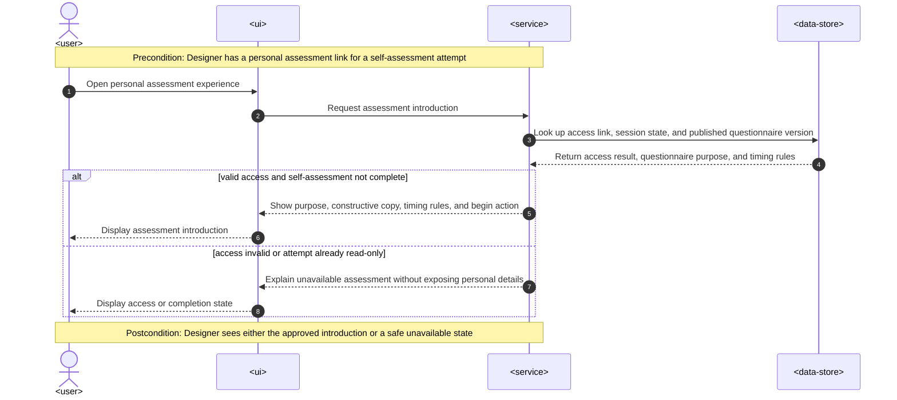

### Complete timed self-assessment

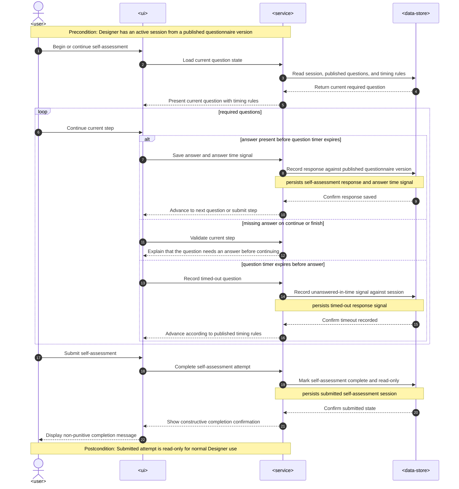

### Review assigned Designer profile

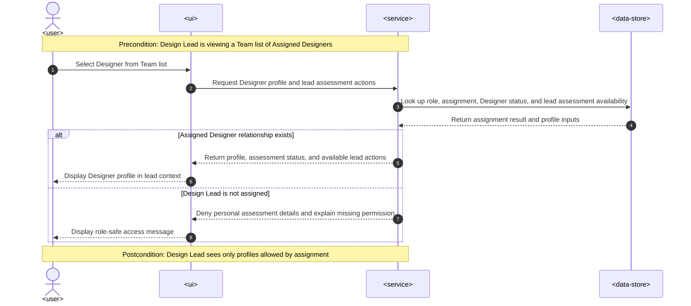

### Complete Lead assessment

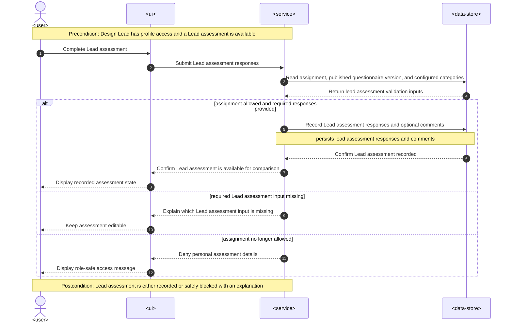

### Configure and publish questionnaire

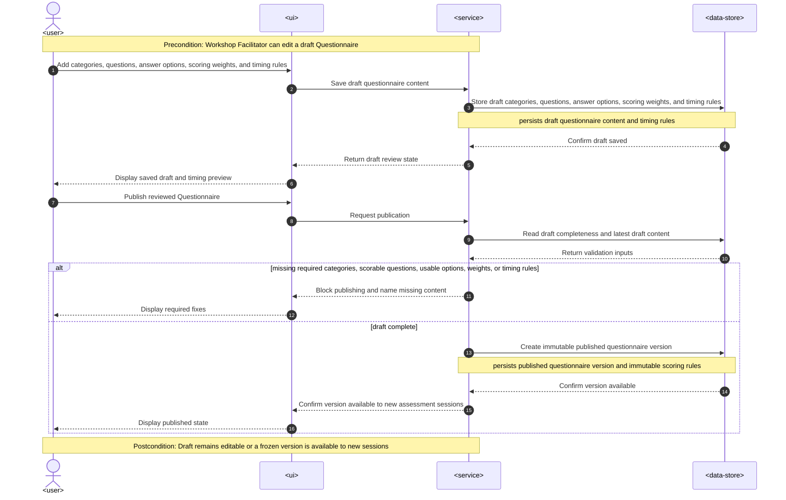

### Calculate maturity score

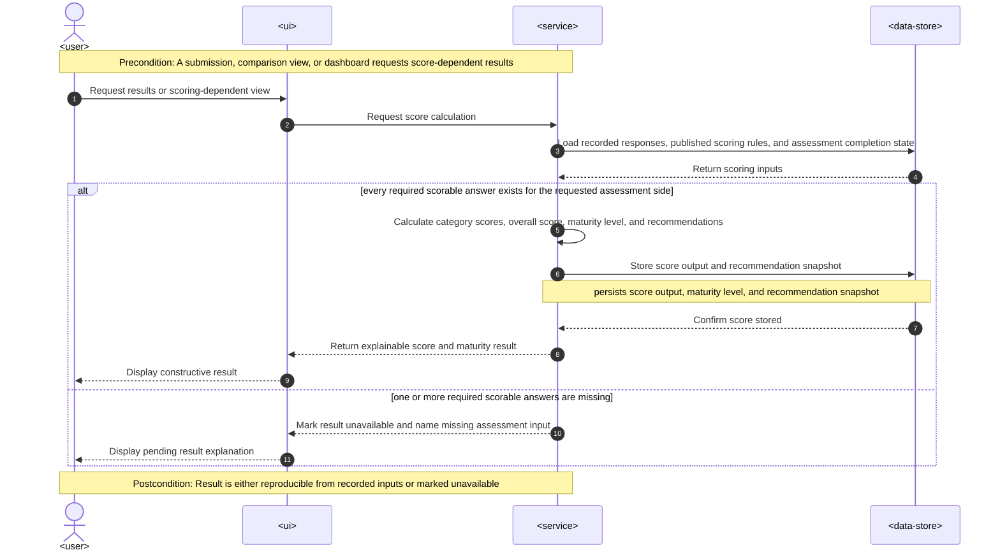

### Compare self and Lead assessments

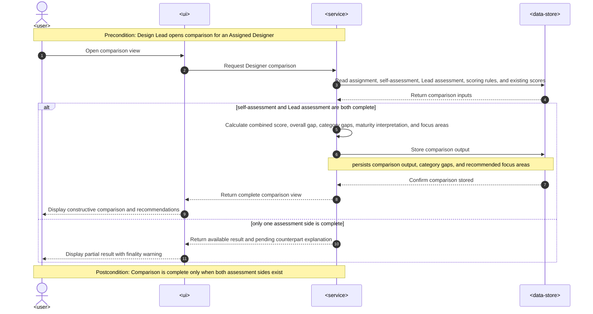

### View Team dashboard

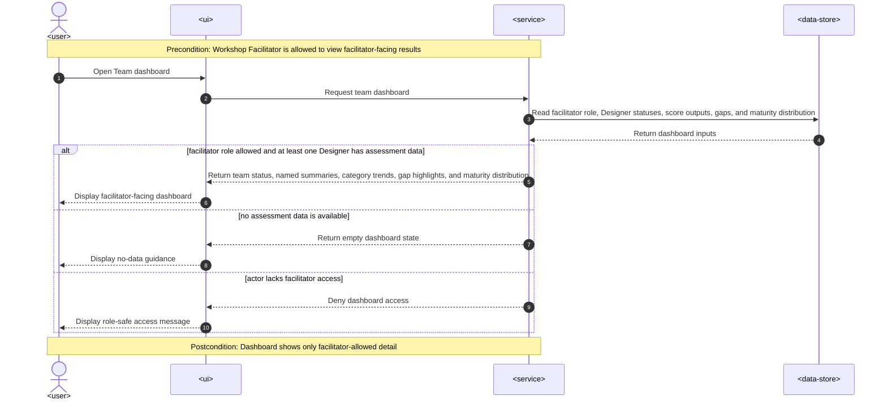

### Present workshop results

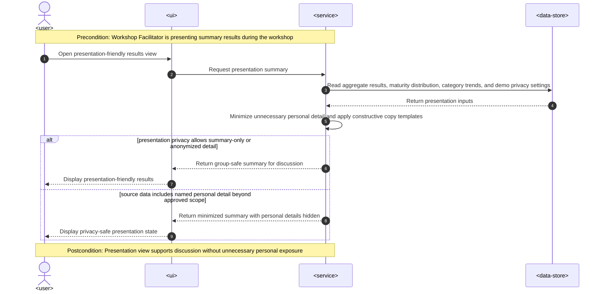

### Runtime coverage check

**User story coverage:**

| User story | Runtime flow |
|---|---|
| US-01 Open self-assessment | Open self-assessment |
| US-02 Complete timed questionnaire | Complete timed self-assessment |
| US-03 See completion confirmation | Complete timed self-assessment |
| US-04 Review designer profile | Review assigned Designer profile |
| US-05 Complete lead assessment | Complete Lead assessment |
| US-06 Configure questionnaire | Configure and publish questionnaire |
| US-07 Configure timing rules | Configure and publish questionnaire |
| US-08 Calculate maturity score | Calculate maturity score |
| US-09 Compare assessments | Compare self and Lead assessments |
| US-10 View team dashboard | View Team dashboard |
| US-11 Present workshop results | Present workshop results |

**Acceptance-criteria coverage:**

| Acceptance criterion | Runtime coverage |
|---|---|
| AC-01 | Open self-assessment happy branch shows purpose, constructive wording, timing rules, and begin action. |
| AC-02 | Complete timed self-assessment happy branch records responses against a published version and marks the submitted attempt read-only. |
| AC-03 | Complete timed self-assessment missing-answer branch keeps the current step and explains the required answer. |
| AC-04 | Complete timed self-assessment timer-expiry branch records the unanswered-in-time signal and advances by published timing rules. |
| AC-05 | Complete timed self-assessment completion path returns constructive, non-punitive confirmation. |
| AC-06 | Review assigned Designer profile happy branch returns profile, status, and lead-assessment actions. |
| AC-07 | Review assigned Designer profile denied branch hides personal details and explains missing permission. |
| AC-08 | Complete Lead assessment happy branch records Lead assessment responses for later comparison. |
| AC-09 | Configure and publish questionnaire draft-save path persists categories, questions, options, scoring weights, and timing rules. |
| AC-10 | Configure and publish questionnaire publish-validation branch blocks publishing and names missing content. |
| AC-10b | Configure and publish questionnaire publish-success branch persists an immutable published Questionnaire version. |
| AC-11 | Configure and publish questionnaire saves timing rules, and Open self-assessment displays them before Designers begin. |
| AC-12 | Calculate maturity score happy branch produces category scores, overall score, maturity level, and recommendations from recorded inputs. |
| AC-13 | Calculate maturity score missing-input branch marks the result unavailable and names the missing assessment input. |
| AC-14 | Compare self and Lead assessments complete branch shows self-score, Lead-score, combined score, gaps, maturity interpretation, and focus areas. |
| AC-15 | Compare self and Lead assessments partial branch shows available result and explains the missing counterpart. |
| AC-16 | View Team dashboard happy branch shows team status, named summaries, trends, gap highlights, and maturity distribution. |
| AC-17 | Present workshop results happy and privacy-minimized branches provide a discussion-ready summary with unnecessary personal detail hidden. |

### Runtime flags for downstream stages

- New participants needed by these flows: none beyond the declared `backend-service`, `web-frontend`, and relational data-store containers in §5.
- Async runtime paths: none in the current spec. No `<message-bus>` or `<external-system>` flow is required.
- Persist hints for `data-model`: draft questionnaire content, published questionnaire version, self-assessment responses, answer time signals, timed-out response signals, submitted session state, Lead assessment responses and comments, score outputs, maturity levels, recommendation snapshots, comparison outputs, category gaps, and recommended focus areas.

## 7. Deployment view

The workshop MVP runs as one web application deployment with a relational database. Local development can use a local SQLite database file and seed data; the demo environment should use the same schema through a PostgreSQL-compatible managed database if the workshop needs multi-user durability. The app runtime can scale horizontally only after session writes and score calculations are proven stateless outside the database.

**Monitoring:**
- `answer_save_latency_ms` - measured for assessment answer save feedback, targeting p95 <= 300 ms in the workshop environment.
- `score_calculation_latency_ms` - measured for a cohort of 100 Designers, targeting p95 <= 2 s.
- `dashboard_load_latency_ms` - measured for 100 Designers and 1 active Questionnaire, targeting p95 <= 2 s.
- `assessment_submit_count`, `timed_out_question_count`, `access_denied_count`, and `score_calculation_error_count` - reviewed during rehearsal and live workshop.
- Alerts during rehearsal/live window: answer save p95 above 300 ms for 5 minutes, dashboard p95 above 2 s for 5 minutes, or any repeated score calculation errors.

**Scaling thresholds:**
- Support >= 50 active assessment sessions without data loss in the workshop smoke test before demo.
- Keep the simple deployment until the 100-Designer benchmark approaches p95 <= 2 s limits for scoring or dashboard load.
- Add read-model caching or precomputed dashboard summaries only after measurements show the dashboard cannot meet p95 <= 2 s for 100 Designers and 1 active Questionnaire.

## 8. Crosscutting concepts

| Concept | Convention | Where defined |
|---|---|---|
| Authentication / access | Use workshop-friendly personal links for Designers and facilitator-seeded access for Design Leads. Every server handler still checks the effective role and assignment. | ADR-0005; spec §6.1 |
| Authorization | Designers can access only their own self-assessment; Design Leads can access Assigned Designers; Workshop Facilitator can configure Questionnaires and see facilitator-facing dashboards. | CONTEXT.md glossary; spec §6.1 |
| Published Questionnaire immutability | Sessions always reference a published Questionnaire version whose questions, answer options, scoring weights, and timing rules remain unchanged. | ADR-0006; spec AC-10b |
| Scoring integrity | Browser input stores answers and timing signals only; backend services calculate all scores and gaps from recorded responses and published scoring rules. | ADR-0004; spec §6.1 |
| Recommendation tone | Recommendations come from constructive rule templates and copy QA, not punitive labels or uncontrolled generation. | ADR-0007; CONTEXT.md invariants |
| Error handling | Blocking validation messages name the missing or invalid action in plain language and avoid technical blame. | spec §6 NFR |
| Data recovery | Submitted responses are persisted immediately enough that no submitted assessment response is lost after page refresh. | spec §6 NFR |
| Observability | Log assessment submission, access denial, questionnaire publishing, score calculation, and dashboard load events with role-safe identifiers. | §7 Deployment view |
| Rate limiting | Limit repeated questionnaire configuration actions to 20 per minute per Workshop Facilitator during the workshop. | spec §6.1 abuse cases |
| Accessibility | Core assessment, lead assessment, and dashboard flows target WCAG 2.2 AA and keyboard-only QA. | spec §6 NFR |

## 9. Architecture decisions

| # | Title | Status | Section |
|---|---|---|---|
| 0001 | Build backend-service and web-frontend surfaces | Accepted | §4 |
| 0002 | Use a hybrid Next.js full-stack web architecture | Accepted | §4 |
| 0003 | Use relational persistence with Prisma-managed schema | Accepted | §4 |
| 0004 | Calculate scores on the server from recorded responses | Accepted | §4 |
| 0005 | Use lightweight workshop access boundaries | Accepted | §4 |
| 0006 | Freeze published Questionnaire versions for Assessment sessions | Accepted | §4 |
| 0007 | Generate recommendations from constructive rule templates | Accepted | §4 |

ADR files live under `docs/features/questionnaire-voting-machine/adr/`.

## 10. Quality requirements

**QG-1. Workshop responsiveness under live usage**
- **When:** Designers, Design Leads, and the Workshop Facilitator use the system during the workshop rehearsal or live demo.
- **Then:** Assessment answer save feedback meets p95 <= 300 ms in the workshop environment; result calculation meets p95 <= 2 s for a cohort of 100 Designers; dashboard load meets p95 <= 2 s for a cohort of 100 Designers and 1 active Questionnaire; concurrent workshop usage supports >= 50 active assessment sessions without data loss.
- **How verify:** Browser performance traces during smoke test for answer save and dashboard load, automated scoring benchmark for 100 Designers, and load smoke test before demo.

**QG-2. Role-scoped confidentiality**
- **When:** A Designer, Design Lead, or Workshop Facilitator requests assessment details, comparison results, dashboard data, or presentation-friendly results.
- **Then:** Designers access only their own assessment; Design Leads access only Assigned Designers from their Team list; Lead assessment results are never shown to a Designer unless the Workshop Facilitator explicitly configures that visibility; presentation-friendly results minimize unnecessary personal detail.
- **How verify:** Integration tests for allowed/denied access cases, manual QA of presentation mode, and Security Lead review of spec §6.1 abuse cases.

**QG-3. Durable assessment submission and constructive interpretation**
- **When:** A participant refreshes during assessment, submits answers, or opens results after one or both assessment sides are complete.
- **Then:** No submitted assessment response is lost after a page refresh; 100% of blocking validation messages name the missing or invalid action in plain language; 100% of maturity labels, recommendations, and dashboard summaries use approved constructive copy templates and pass QA review before the workshop demo.
- **How verify:** Integration test and manual refresh scenario, manual QA checklist for validation messages, and copy QA checklist before demo.

**QG-4. Workshop availability**
- **When:** The scheduled workshop window is running.
- **Then:** Availability during workshop is >= 99.0% for the scheduled workshop window.
- **How verify:** Uptime check during rehearsal and live session, plus smoke checks for assessment start, answer save, score calculation, dashboard, and presentation mode.

**QG-5. Accessibility of core flows**
- **When:** Users complete the core assessment, lead assessment, and dashboard flows by keyboard and assistive technology basics.
- **Then:** Accessibility meets WCAG 2.2 AA for core assessment, lead assessment, and dashboard flows.
- **How verify:** Accessibility audit and keyboard-only QA before demo.

## 11. Risks and technical debt

| Risk / debt | Severity | Mitigation | Owner |
|---|---|---|---|
| The existing `src/` Vite + React SPA prototype diverges from the target Next.js + Prisma production stack (different framework, no backend or persistence). | Medium | Treat the prototype as throwaway visual reference only; build the production scaffold fresh per ADR-0002/0003 and retire the Vite SPA once the production frontend reaches parity. Reconcile or remove the prototype before the first production frontend task. | Tech Lead |
| No production app scaffold exists yet, so runtime/framework/database versions are not pinned. | Medium | Pin versions during project setup before implementation starts; update this SAD only if the chosen stack changes the architecture. | Tech Lead |
| No persisted architecture map exists for the repo. | Medium | Run `/sdd:survey questionnaire-voting-machine` or create `docs/architecture-map.md` once the scaffold exists. | Tech Lead |
| Lightweight access links may be guessed or shared. | High | Use signed, hard-to-guess tokens, short demo validity, server-side role checks, and access-denied logging. | Security Lead |
| Presentation mode may accidentally expose named personal detail during a live demo. | High | Use fictional Designers by default and test the presentation-friendly results view with Security Lead before dry run. | Workshop Facilitator |
| Timer behavior may feel punitive or lose progress on refresh. | Medium | Persist answer progress immediately, describe timing as a signal, and QA all timeout and refresh states. | Product Owner |
| Score interpretation may sound like HR performance ranking. | High | Use constructive copy templates, copy QA, and keep HR performance ranking out of scope. | Workshop Facilitator |
| SQLite local workflow may hide production-like concurrency issues. | Medium | Keep schema PostgreSQL-compatible and run a demo-environment smoke test before the workshop. | Tech Lead |
| Open implementation detail: assessment link expiration and distribution. | Open question | Resolve before `sdd:tasks`; ADR-0005 locks the access model as personal assessment links plus facilitator-seeded assignments, but the exact token lifetime and distribution path still need a task-ready default. | Workshop Facilitator |
| Open product decision: Lead comments required or optional. | Open question | Resolve before `sdd:tasks`; default is optional comment per category plus one summary comment. | Product Owner |
| Open product decision: category and combined-score weights. | Open question | Resolve before `sdd:data-model`; default is equal category weighting with Lead assessment weighted more than self-assessment in combined score. | Product Owner |
| Open product decision: live demo data privacy rule. | Open question | Resolve before workshop dry run; default is fictional Designers and anonymized team summaries. | Security Lead |

**Accepted debt (acceptable in v1, plan to fix later):**
- Full authentication and enterprise RBAC are deferred; the MVP uses workshop-friendly access boundaries.
- Historical progress tracking is deferred; the MVP covers one assessment cycle.
- AI-generated questionnaires and AI-generated personal learning plans are deferred; recommendations use controlled templates.
- Advanced analytics warehouse and enterprise reporting are deferred; the Team dashboard is scoped to workshop presentation and facilitation.

## 12. Glossary

| Term | Meaning |
|---|---|
| AI competency | A designer's observable knowledge, judgment, and practical use of AI across design work. |
| AI maturity level | A five-level interpretation of assessment results that explains current AI practice in constructive language. |
| Assigned Designer | A Designer whom the Workshop Facilitator has explicitly linked to a Design Lead for lead assessment and visibility. |
| Assessment category | A skill area used to group questions and scores, such as Prompting Skills or Critical Thinking and AI Safety. |
| Assessment session | A time-bounded attempt by a Designer or Design Lead to answer an assessment for one Designer. |
| Answer time signal | Timing data that helps interpret assessment reliability, such as unusually fast or slow answers. |
| Category gap | The difference between self-assessment and lead assessment within one assessment category. |
| Combined score | A weighted score that blends self-assessment and lead assessment to summarize AI competency. |
| Designer | A UX/UI designer who completes a self-assessment of their AI knowledge, AI usage, and AI safety judgment. |
| Design Lead | A lead or manager who evaluates a Designer from an observer perspective using similar AI competency criteria. |
| Lead assessment | A Design Lead's assessment of a Designer's practical AI competency. |
| Presentation-friendly results view | A facilitator-facing summary mode that hides unnecessary personal detail during a live workshop demo. |
| Questionnaire | A configured set of categories, questions, answer options, scoring rules, and timing rules used for assessment. |
| Recommendation | A constructive next learning step generated from scores and gaps. |
| Self-assessment | A Designer's own answers about AI knowledge, usage, confidence, and critical judgment. |
| Team dashboard | A facilitator-facing view of named Designer summaries, aggregate scores, gaps, maturity levels, and category trends. |
| Team list | The facilitator-seeded list of Assigned Designers a Design Lead can review and assess during the workshop. |
| Workshop Facilitator | The person who configures the questionnaire, demonstrates the system, and presents results during the workshop; also called Admin in workshop notes. |
