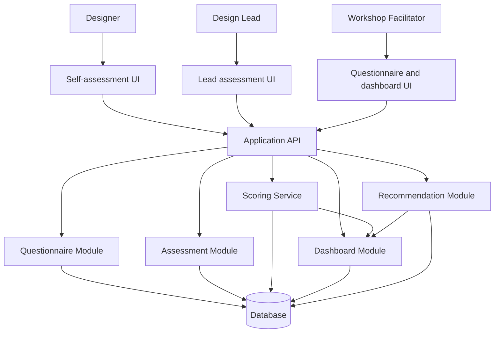

# Workshop Project Brief - questionnaire-voting-machine

Updated: 2026-06-13  
Status: Draft  
Feature size: M  
Formal SDD spec: [spec.md](./spec.md)  
Domain glossary: [CONTEXT.md](./CONTEXT.md)

## 1. Product Idea

**questionnaire-voting-machine** is a web-based assessment product for understanding AI competency among UX/UI designers. It combines Designer self-assessment with Design Lead assessment, compares the two perspectives, calculates scores, highlights gaps, and translates the results into constructive AI maturity levels and learning recommendations.

The product should help a company answer:

- How well do designers understand AI capabilities, limitations, and risks?
- How often do designers use AI in real design work?
- Which design tasks already benefit from AI?
- Where do designers overestimate or underestimate their AI maturity?
- Which skills should be developed at team level?
- Who can mentor others, and who needs more guided practice?

The workshop version is intentionally educational. Participants use this product to walk through discovery, requirements, UX flow, architecture, data model, API design, AI-assisted implementation, testing, deployment, demo, and retrospective.

## 2. PRD

### A. Project Overview

| Field | Description |
|---|---|
| Name | questionnaire-voting-machine |
| One-liner | A constructive AI competency assessment tool for UX/UI designers and design leads. |
| Problem statement | Teams encourage designers to use AI, but lack a structured, balanced, non-punitive way to understand real AI knowledge, usage, safety judgment, and skill gaps. |
| Product goal | Create a realistic snapshot of AI competency across a design team using self-assessment, lead assessment, scoring, comparison, and recommendations. |
| Target users | Designer, Design Lead, Workshop Facilitator. |
| Value proposition | Designers get a clearer development path; leads understand observed skill levels; facilitators get a teachable SDLC project with visible product value. |
| Workshop learning value | The project is broad enough to teach full SDLC, but small enough to implement as an MVP during a guided workshop. |

### B. Product Discovery

**Personas**

- **Designer:** wants to understand their AI strengths and growth areas without feeling judged.
- **Design Lead:** wants evidence-based visibility into practical AI usage across the team.
- **Workshop Facilitator:** wants a complete project that demonstrates product thinking, architecture, AI-assisted development, and testing.

**Jobs to be done**

- Designer: "When I assess my AI skills, I want a fair and practical questionnaire so I can see what to improve next."
- Design Lead: "When I review a designer, I want a structured assessment so I can compare self-perception with observed work behavior."
- Workshop Facilitator: "When I teach SDLC, I want one realistic product case so participants see how every artifact connects."

**User pains**

- AI skill discussions are often subjective and anecdotal.
- Designers may overestimate tool usage without validating output quality.
- Leads lack a shared vocabulary for AI maturity.
- Workshops often use toy examples that do not reflect real product complexity.
- Assessments can feel punitive if wording and visibility are not handled carefully.

**User motivations**

- Designers want growth, recognition, and practical learning plans.
- Leads want better coaching and team capability planning.
- Facilitators want an engaging, end-to-end case study.

**Success metrics**

- At least 90% of demo Designers complete self-assessment in the workshop run.
- At least 80% of prepared demo Designer profiles receive Lead assessment.
- 100% of result labels and recommendations use constructive wording.
- Participants can explain the score, gap, and maturity model after the demo.

### C. Functional Requirements

**Designer flow**

- Open a personal assessment link or sign in through a workshop-friendly access mechanism.
- Read intro, rules, tone, and timing expectations.
- Answer single choice, multiple choice, rating, scenario, yes/no, and optional short-answer questions.
- See a per-question timer and optional full-test timer.
- Submit the assessment and see confirmation.
- Avoid unlimited editing after submission.

**Lead flow**

- View a list of Designers.
- Open a Designer profile.
- Complete Lead assessment using the same categories or observer-oriented variants.
- Add optional comments.
- View comparison between self-score and lead-score when available.

**Workshop Facilitator flow**

- Create and edit a Questionnaire.
- Add categories, questions, answer options, weights, and preferred answers.
- Configure timers and publication state.
- View dashboard and presentation mode.
- Export or demonstrate summary results when available.

**Questionnaire management**

- Categories can be created, ordered, and weighted.
- Questions belong to one category.
- Answer options can be randomized.
- Question order can be randomized.
- Publishing is blocked when the questionnaire has no categories, no questions, or unusable answer options.

**Scoring**

- Each scorable answer contributes points.
- Each question has a weight.
- Category score is normalized to 0-100.
- Self-score and lead-score are calculated separately.
- Combined score uses a configurable weighted formula.
- Maturity level is derived from combined score.

**Dashboard**

- Show team status, completed assessments, missing assessments, average scores, maturity distribution, and category gaps.
- Support filtering by Designer.
- Show individual comparison and recommendations.
- Provide presentation-friendly mode with reduced personal detail.

**Timer**

- Support per-question timing and full-assessment timing.
- Record answer duration.
- Mark unanswered questions when time expires.
- Flag unusually fast or slow answers as signals, not accusations.

**Comparison logic**

- Compare self-score, lead-score, combined score, overall gap, and category gaps.
- Interpret positive and negative gaps constructively.
- Show "pending comparison" when one side is missing.

### D. Non-functional Requirements

- Core flows should remain understandable for first-time workshop participants.
- Assessment answer feedback should feel immediate in the workshop environment.
- Dashboard should load fast enough for live presentation.
- Core UI should support keyboard navigation and WCAG 2.2 AA basics.
- Scores must be calculated server-side, not trusted from the browser.
- Personal results must not be exposed to the wrong role.
- Error messages must be clear, constructive, and non-technical.
- The workshop demo must remain stable with about 50 active participants.

### E. Out of Scope

- Full authentication and enterprise role management.
- Payments or subscriptions.
- HR, LMS, Slack, or enterprise integrations.
- Full proctoring, video monitoring, or invasive anti-fraud systems.
- Historical progress tracking.
- Adaptive testing.
- Production-grade analytics warehouse.

## 3. MVP Scope

### Must Have

- Designer list.
- Designer profile.
- Questionnaire creation.
- Assessment categories.
- Questions with answer options.
- Timer per answer.
- Designer self-assessment flow.
- Lead assessment flow.
- Score calculation.
- Comparison between self-score and lead-score.
- Overall AI maturity level.
- Results dashboard.

### Should Have

- Detailed category-level results.
- Lead comments.
- Development recommendations.
- Skill gap highlights.
- Presentation mode for workshop demo.

### Could Have

- QR code or link for assessment access.
- CSV export.
- AI-generated recommendations.
- AI-generated learning plan.
- Anonymous team benchmark.

### Will Not Have in MVP

- Full authentication.
- Payments.
- Complex access roles.
- HR integrations.
- Full proctoring.
- Video monitoring.
- Complex anti-fraud system.

## 4. Requirements

### AI Competency Categories

| Category | What It Measures |
|---|---|
| AI Awareness | Understanding of AI, LLMs, generative AI, prompting basics, tool capabilities, limitations, and hallucinations. |
| Prompting Skills | Ability to provide context, define roles, specify formats, set constraints, and improve prompts iteratively. |
| UX Research with AI | Use of AI for interview analysis, insight synthesis, personas, JTBD, journeys, and competitor analysis. |
| UX Writing with AI | Use of AI for microcopy, error messages, empty states, onboarding, FAQs, and tone-of-voice exploration. |
| Ideation and Concepting | Use of AI for ideas, variants, concepts, hypotheses, and scenarios. |
| UI and Visual Exploration | Use of AI for moodboards, references, visual directions, image generation, and UI pattern discovery. |
| Design Review and Critique | Use of AI for UX audits, accessibility checks, usability critique, and clarity review. |
| Workflow Automation | Use of AI for documentation, summaries, handoff notes, meeting notes, and research synthesis. |
| Critical Thinking and AI Safety | Understanding of hallucinations, bias, privacy, copyright, overreliance, confidential data, and validation. |

### Assessment Mechanics

- Designer self-assessment measures knowledge, usage frequency, confidence, applied scenarios, validation habits, and limitation awareness.
- Lead assessment measures observed project usage, work quality impact, decision explainability, safe usage, and ability to help others.
- Comparative analysis shows self-score, lead-score, gap, category gaps, combined score, maturity level, and recommendation.
- Anti-cheating mechanics support timing, randomization, practical scenarios, limited backward navigation, answer-time tracking, and suspicious timing signals.
- Anti-cheating language must remain developmental: timing exists to improve snapshot quality, not to punish participants.

### AI Maturity Model

| Level | Name | Score Range | Interpretation |
|---|---|---:|---|
| 1 | AI Curious | 0-24 | Has tried AI tools occasionally but has no stable design workflow yet. |
| 2 | AI Beginner | 25-44 | Uses AI for simple tasks, often with ready-made prompts and limited validation. |
| 3 | AI Practitioner | 45-64 | Uses AI regularly, writes workable prompts, validates output, and applies AI to design tasks. |
| 4 | AI Power User | 65-84 | Integrates AI across many design stages, builds custom prompts, combines tools, and helps peers. |
| 5 | AI Design Leader | 85-100 | Shapes team practices, teaches others, creates standards, and evaluates AI risks critically. |

### Product Tone

Use:

- growth area
- recommended focus
- AI skill gap
- next learning step
- needs more practice

Avoid:

- weak designer
- failed test
- bad AI skills
- low performer
- punishment

## 5. Sample Questionnaire

| # | Category | Type | Question | Answer Options | Preferred Answer | Weight | Explanation |
|---:|---|---|---|---|---|---:|---|
| 1 | AI Awareness | Rating 1-5 | How confident are you explaining what an LLM can and cannot do? | 1 Not confident; 2 Basic; 3 Moderate; 4 Strong; 5 Can teach others | Higher is better, but compared with Lead assessment | 1.0 | Measures self-perceived conceptual awareness. |
| 2 | Workflow Automation | Single choice | How often do you use AI in your design process? | Never; Rarely; Weekly; Several times per week; Daily | Several times per week or Daily | 1.0 | Measures practical adoption frequency. |
| 3 | UX Research with AI | Multiple choice | Which UX tasks have you used AI for in the last month? | Interview summary; Insight synthesis; Persona draft; Competitor analysis; I have not used AI for these | Any real usage options score; "not used" scores low | 1.2 | Measures recent applied usage. |
| 4 | Critical Thinking and AI Safety | Single choice | What would you do if AI gave a convincing but unverified research claim? | Use it directly; Ask AI again; Verify against source material; Ignore all AI output | Verify against source material | 1.5 | Measures validation behavior. |
| 5 | Prompting Skills | Scenario | Which prompt is strongest for generating personas from research notes? | "Make personas"; "Create 3 personas"; "Act as a UX researcher, use these notes, cite evidence, flag assumptions, output persona table"; "Give ideas" | Context-rich prompt with role, source, constraints, and output format | 1.5 | Measures prompt structure quality. |
| 6 | Critical Thinking and AI Safety | Yes/No | Is it acceptable to paste confidential client data into a public AI tool without approval? | Yes; No | No | 2.0 | Measures privacy and confidentiality judgment. |
| 7 | Design Review and Critique | Multiple choice | How can AI help with a UX audit? | Identify unclear flows; Check accessibility risks; Summarize heuristic issues; Replace user testing completely | First three are useful; replacing testing is not preferred | 1.3 | Measures realistic AI critique usage. |
| 8 | UX Writing with AI | Scenario | You need better empty-state copy for a finance app. What prompt behavior is best? | Ask for funny text; Provide product context, audience, tone, constraints, and examples; Ask for 50 random options; Copy competitor text | Provide context, audience, tone, constraints, and examples | 1.2 | Measures practical UX writing prompting. |
| 9 | Ideation and Concepting | Rating 1-5 | How often do you use AI to explore alternative concepts before choosing a design direction? | 1 Never; 2 Rarely; 3 Sometimes; 4 Often; 5 Always with critique | Higher is better when paired with critique | 1.0 | Measures ideation usage. |
| 10 | UI and Visual Exploration | Multiple choice | Which AI-assisted visual exploration practices are appropriate? | Moodboard directions; Visual reference prompts; Accessibility-blind image generation; UI pattern discovery; Copying generated assets into final work without review | Moodboards, references, and pattern discovery | 1.1 | Measures safe visual exploration. |
| 11 | Workflow Automation | Short answer | Describe one routine design task you could automate with AI and how you would review the result. | Free text | Mentions task, AI role, and human review step | 1.4 | Measures applied thinking, not memorization. |
| 12 | Lead assessment | Rating 1-5 | The Designer can explain why an AI-assisted design decision is valid. | 1 Not observed; 2 Rarely; 3 Sometimes; 4 Often; 5 Consistently teaches others | Higher is better | 1.5 | Measures observed explainability from the Lead perspective. |

## 6. User Stories and Acceptance Criteria

The formal traceable version is in [spec.md](./spec.md). Workshop-facing minimum set:

1. **Designer completes self-assessment**  
   Given a published questionnaire, when the Designer answers required questions and submits, then the system records the self-assessment and prevents unlimited editing.

2. **Designer sees completion confirmation**  
   Given the self-assessment was accepted, when submission finishes, then the Designer sees a constructive confirmation message.

3. **Lead opens a Designer profile**  
   Given the Lead has access to a Designer list, when the Lead selects a Designer, then the system shows status, profile context, and available assessment actions.

4. **Lead evaluates a Designer**  
   Given a Lead assessment is available, when the Lead completes it, then the system records the assessment and makes it available for comparison.

5. **Facilitator creates a questionnaire**  
   Given the Facilitator is configuring the workshop, when categories and questions are added, then the system saves a draft questionnaire.

6. **Facilitator configures the timer**  
   Given a draft questionnaire exists, when the Facilitator sets timing rules, then the system applies them to the assessment intro and question flow.

7. **System calculates the score**  
   Given scorable answers exist, when results are calculated, then the system produces category scores, overall score, and maturity level.

8. **System compares self-score and lead-score**  
   Given both assessments are complete, when comparison is opened, then the system shows scores, gaps, maturity interpretation, and recommendations.

9. **Facilitator views dashboard**  
   Given assessment data exists, when the Facilitator opens the dashboard, then team-level status, maturity distribution, and category gaps are visible.

10. **Facilitator presents results**  
    Given the workshop demo is running, when presentation mode is opened, then the system shows a clear summary with reduced personal detail.

## 7. UX Flows

### Designer Self-assessment Flow

1. Designer opens the assessment link.
2. Designer sees intro screen with purpose and tone.
3. Designer sees rules, timer, privacy note, and start action.
4. Designer answers timed questions.
5. Designer completes the assessment.
6. Designer sees confirmation screen.

### Lead Assessment Flow

1. Lead opens Designer list.
2. Lead selects a Designer.
3. Lead sees Designer profile and assessment status.
4. Lead completes Lead assessment.
5. Lead saves the result.
6. Lead sees comparison view when self-assessment is available.

### Admin Setup Flow

1. Facilitator creates a questionnaire.
2. Facilitator adds categories.
3. Facilitator adds questions.
4. Facilitator configures scoring.
5. Facilitator configures timing rules.
6. Facilitator publishes the assessment.

### Results Dashboard Flow

1. Facilitator opens dashboard.
2. Facilitator sees overall team status.
3. Facilitator filters results by Designer.
4. Facilitator opens a specific Designer profile.
5. Facilitator sees category scores.
6. Facilitator sees self vs lead gap.
7. Facilitator sees maturity level and recommendations.

## 8. Data Model

### Designer

- Fields: id string required; name string required; email string optional; team string optional; leadId string optional; createdAt datetime required.
- Relations: belongs to one Lead optionally; has many AssessmentSessions; has many Scores.
- Notes: use fictional or minimal personal data in workshop demo.

### Lead

- Fields: id string required; name string required; email string optional; team string optional; createdAt datetime required.
- Relations: has many Designers; has many LeadAssessmentResponses through sessions.
- Notes: can assess assigned Designers.

### Questionnaire

- Fields: id string required; title string required; description string optional; status enum draft or published required; fullTimeLimitSec integer optional; questionTimeLimitSec integer optional; randomizeQuestions boolean required; randomizeOptions boolean required; createdAt datetime required; publishedAt datetime optional.
- Relations: has many Categories; has many Questions; has many AssessmentSessions.
- Notes: publishing requires at least one category and scorable question.

### Category

- Fields: id string required; questionnaireId string required; name string required; description string optional; weight decimal required; order integer required.
- Relations: belongs to Questionnaire; has many Questions; has many Scores.
- Notes: default equal category weights are acceptable for MVP.

### Question

- Fields: id string required; questionnaireId string required; categoryId string required; text string required; type enum required; weight decimal required; order integer required; required boolean required; explanation string optional.
- Relations: belongs to Questionnaire and Category; has many AnswerOptions; has many responses.
- Notes: supported types are single choice, multiple choice, rating, scenario, yes/no, and short answer.

### AnswerOption

- Fields: id string required; questionId string required; label string required; value string required; score decimal optional; isPreferred boolean optional; order integer required; explanation string optional.
- Relations: belongs to Question.
- Notes: score may be absent for free-text questions that need manual review.

### AssessmentSession

- Fields: id string required; designerId string required; questionnaireId string required; assessorType enum designer or lead required; leadId string optional; status enum notStarted, inProgress, submitted, expired required; startedAt datetime optional; submittedAt datetime optional; totalDurationSec integer optional.
- Relations: belongs to Designer and Questionnaire; optionally belongs to Lead; has responses and Scores.
- Notes: one session represents one actor's attempt.

### SelfAssessmentResponse

- Fields: id string required; sessionId string required; designerId string required; questionId string required; selectedOptionIds string list optional; textAnswer string optional; answerDurationSec integer optional; timedOut boolean required; createdAt datetime required.
- Relations: belongs to AssessmentSession, Designer, and Question.
- Notes: used only for Designer self-assessment.

### LeadAssessmentResponse

- Fields: id string required; sessionId string required; leadId string required; designerId string required; questionId string required; selectedOptionIds string list optional; rating integer optional; comment string optional; answerDurationSec integer optional; createdAt datetime required.
- Relations: belongs to AssessmentSession, Lead, Designer, and Question.
- Notes: observer perspective may include comments.

### Score

- Fields: id string required; designerId string required; questionnaireId string required; sessionId string optional; scoreType enum self, lead, combined, category required; categoryId string optional; value decimal required; gap decimal optional; maturityLevel integer optional; calculatedAt datetime required.
- Relations: belongs to Designer, Questionnaire, optionally Session and Category.
- Notes: combined score is recalculated when self or lead assessment changes.

### Recommendation

- Fields: id string required; designerId string required; categoryId string optional; maturityLevel integer optional; title string required; description string required; priority enum low, medium, high required; createdAt datetime required.
- Relations: belongs to Designer and optionally Category.
- Notes: wording must remain constructive.

## 9. API Design

Recommended MVP style: REST API with server-side score calculation.

| Endpoint | Method | Path | Request Body | Response Body | Validation | Possible Errors |
|---|---|---|---|---|---|---|
| Create questionnaire | POST | /api/questionnaires | title, description, timing, randomization flags | questionnaire | title required; timers positive | validation error; duplicate title |
| Get questionnaire | GET | /api/questionnaires/{id} | none | questionnaire with categories and questions | id exists; access allowed | not found; access denied |
| Create designer | POST | /api/designers | name, email, team, leadId | designer | name required; email valid if provided | validation error; lead not found |
| Get designer profile | GET | /api/designers/{id} | none | designer, sessions, scores, recommendations | id exists; role can view | not found; access denied |
| Start self-assessment | POST | /api/assessments/self/start | designerId, questionnaireId | session, first question | questionnaire published; no completed active session conflict | questionnaire unavailable; already completed |
| Submit self-assessment answer | POST | /api/assessments/self/{sessionId}/answers | questionId, selectedOptionIds or textAnswer, answerDurationSec | saved response, next question state | session active; answer shape matches question type | invalid answer; session expired |
| Complete self-assessment | POST | /api/assessments/self/{sessionId}/complete | none | completed session summary | required answers handled; session active | incomplete session; expired session |
| Start lead assessment | POST | /api/assessments/lead/start | leadId, designerId, questionnaireId | session, first question | lead can assess designer; questionnaire published | access denied; questionnaire unavailable |
| Submit lead assessment answer | POST | /api/assessments/lead/{sessionId}/answers | questionId, selectedOptionIds, rating, comment | saved response, next question state | session active; answer shape valid | invalid answer; session expired |
| Complete lead assessment | POST | /api/assessments/lead/{sessionId}/complete | none | completed session summary | lead session active | incomplete session; expired session |
| Calculate score | POST | /api/scores/calculate | designerId, questionnaireId | selfScore, leadScore, combinedScore, categoryScores, gaps | enough scorable answers; scoring rules published | insufficient data; scoring rules invalid |
| Get designer results | GET | /api/results/designers/{designerId} | none | scores, gaps, maturity, recommendations | role can view designer | not found; access denied |
| Get team dashboard | GET | /api/dashboard/team | filters | team summary, maturity distribution, gaps | role can view dashboard | access denied; no data |
| Get recommendations | GET | /api/recommendations/{designerId} | none | recommendation list | role can view designer | not found; access denied |

## 10. Architecture

### Recommended Workshop Stack

- Frontend: Next.js with React.
- Backend: Next.js API routes for the workshop MVP, or Node.js with Express if the workshop wants a clearer backend boundary.
- Database: SQLite for local workshop implementation; PostgreSQL for a production-like variant.
- ORM: Prisma.
- Testing: Vitest or Jest for unit and integration tests; Playwright for E2E.
- Deployment: Vercel for frontend/full-stack demo; Railway or Render for a service plus database variant.

### Frontend Pages

- `/` - dashboard landing for the workshop demo.
- `/designers` - Designer list.
- `/designers/[id]` - Designer profile and comparison.
- `/assessment/self/[token]` - Designer self-assessment flow.
- `/assessment/lead/[designerId]` - Lead assessment flow.
- `/questionnaires` - questionnaire management.
- `/questionnaires/[id]/edit` - category, question, scoring, and timer setup.
- `/dashboard` - team results dashboard.
- `/present` - presentation-friendly summary.

### Backend Modules

- Questionnaire module: categories, questions, options, publication.
- Assessment module: session lifecycle, timers, response submission.
- Scoring module: score normalization, weighting, maturity, gaps.
- Dashboard module: team summaries and filters.
- Recommendation module: constructive learning focus generation.
- Access module: workshop-friendly role and link checks.

### Mermaid Architecture Diagram

### Deployment Setup

- Local workshop: one app process, local database file, seeded demo data.
- Demo deployment: hosted app with managed database.
- Production-like variant: app service, database service, environment variables, migration command, seed command, and smoke tests.

## 11. Scoring Model

### Core Formula

- Question score = selected answer score * question weight.
- Category score = weighted earned points in category / weighted max points in category * 100.
- Self-score = weighted average of self-assessment category scores.
- Lead-score = weighted average of lead-assessment category scores.
- Combined score = self-score * 0.4 + lead-score * 0.6.
- Gap = lead-score - self-score.
- Category gap = lead category score - self category score.

Lead assessment receives higher weight because it reflects observed project behavior and reduces self-perception bias. Self-assessment remains important because it reveals confidence, awareness, and motivation.

### Interpretation Examples

- **Self-score much higher than lead-score:** Designer may be overestimating AI maturity or not applying AI visibly in real work. Recommended focus: practical workflow evidence and review habits.
- **Lead-score much higher than self-score:** Designer may underestimate their ability. Recommended focus: confidence, sharing practices, and mentoring opportunities.
- **Both scores low:** Designer likely needs guided AI fundamentals and safe workflow practice.
- **Both scores high:** Designer may be an AI Power User or AI Design Leader candidate.
- **Strong category gap:** Target learning plan to the specific category, such as Critical Thinking and AI Safety or UX Research with AI.

## 12. Implementation Plan

| Step | Goal | Expected Output | AI Prompt for Participants | Risks | Validation Checklist |
|---:|---|---|---|---|---|
| 1 | Project setup | App scaffold, tooling, README | "Create a Next.js workshop MVP scaffold with TypeScript, testing, linting, and a clear folder structure." | Over-building setup | App starts locally; README has commands |
| 2 | Database schema | Prisma schema and migration | "Design the Prisma schema for Designers, Leads, Questionnaires, Questions, Sessions, Responses, Scores, and Recommendations." | Wrong relations | Migration runs; seed data loads |
| 3 | Seed demo data | Demo Designers, Lead, categories, questions | "Generate realistic seed data for an AI competency assessment workshop." | Toxic names or labels | Dashboard has demo data; wording is constructive |
| 4 | Questionnaire builder MVP | Create/edit categories, questions, options | "Implement a simple questionnaire builder with category and question editing." | Too many controls | Can create and publish a questionnaire |
| 5 | Designer self-assessment | Intro, timed question flow, submit | "Build the self-assessment flow with question navigation, validation, and completion confirmation." | Timer edge cases | E2E self flow passes |
| 6 | Timer implementation | Per-question timer and answer duration | "Implement timer logic that records unanswered timed-out questions without punitive wording." | Refresh behavior | Timer unit tests and refresh QA pass |
| 7 | Lead assessment | Lead profile and observer assessment | "Build a lead assessment flow for evaluating a designer with the same categories." | Confusing self vs lead wording | Lead can submit assessment |
| 8 | Scoring service | Score, gap, maturity calculation | "Implement pure scoring functions with unit tests for weighting, gaps, and maturity levels." | Frontend score trust | Unit tests pass; server calculates |
| 9 | Comparison view | Self vs lead comparison and gaps | "Create a comparison view with self-score, lead-score, combined score, gaps, and recommendations." | Punitive interpretation | Copy review passes tone checklist |
| 10 | Dashboard | Team summary, filters, maturity distribution | "Build a dashboard for team status, category gaps, and maturity distribution." | Overcrowded UI | Dashboard loads demo data clearly |
| 11 | Tests | Unit, integration, E2E | "Generate tests for scoring, timer, submission, comparison, and dashboard flows." | Brittle tests | All critical tests pass |
| 12 | Deployment | Demo environment | "Prepare deployment config, environment variables, migration command, and smoke test checklist." | Broken live demo | Deployed app opens; seed and smoke pass |
| 13 | Demo polish | Presentation mode and script | "Create a presentation-friendly mode and final demo script for the workshop." | Exposing personal data | Presentation mode hides unnecessary detail |

## 13. Testing Strategy

### Automated Tests

- Unit tests for scoring logic:
  - question weight calculation
  - category normalization
  - self-score
  - lead-score
  - combined score
  - maturity threshold boundaries
  - gap interpretation

- Unit tests for timer logic:
  - question timer expiry
  - full assessment expiry
  - answer duration recording
  - refresh recovery
  - no negative time values

- Integration tests:
  - self-assessment start, answer submission, and completion
  - lead assessment start, answer submission, and completion
  - score calculation from recorded responses
  - comparison when both assessments exist
  - pending comparison when one side is missing

- E2E tests:
  - Designer completes self-assessment.
  - Lead completes assessment.
  - Facilitator opens dashboard.
  - Facilitator enters presentation mode.

### Edge Cases

- Designer does not answer in time.
- Designer refreshes during assessment.
- Lead does not complete assessment.
- Questionnaire has no questions.
- Question has no answer options.
- Score cannot be calculated.
- Self-score exists, but lead-score does not.
- Lead-score exists, but self-score does not.
- Timer expires on the final question.
- Randomized options still score correctly.
- Short-answer question is not automatically scored unless configured.

### Manual QA Checklist

- All core flows work with keyboard only.
- Required validation messages are readable and constructive.
- Timer text is clear and not threatening.
- Designer cannot freely edit after submission.
- Lead assessment is not shown to Designer by default.
- Dashboard does not expose unnecessary personal detail in presentation mode.
- Results use "growth area" and "recommended focus", not punitive labels.
- Seed data is safe to show in a public workshop.

### Security and Privacy Checklist

- Store only necessary personal data.
- Use fictional or anonymized data during workshops.
- Do not send confidential client data to AI tools.
- Restrict access to personal results.
- Protect assessment links from guessing.
- Do not show Lead assessment to Designer without explicit configuration.
- Validate all input fields.
- Do not trust scores from the frontend.
- Calculate scores on the backend.
- Log important events such as assessment submission and score calculation.
- Avoid making results punitive or toxic for the team.

## 14. AI Usage Plan Across SDLC

| Phase | How AI Helps | Example Prompt |
|---|---|---|
| Discovery | Generate personas, pains, jobs, risks | "Act as a Senior Product Manager. Create personas, pains, jobs-to-be-done, and success metrics for an AI competency assessment tool for UX/UI designers." |
| Requirements | Draft user stories, AC, edge cases | "Turn this product idea into user stories and Given/When/Then acceptance criteria. Include happy, error, authorization, domain invariant, and cross-context cases." |
| UX Design | Validate flows and IA | "Review these UX flows for confusion, missing states, and workshop demo clarity. Suggest improvements without adding enterprise scope." |
| Data Model | Find missing entities and relations | "Review this MVP data model for scoring, assessments, timers, and comparison. Identify missing fields and risky relations." |
| API Design | Generate endpoint contracts and validation | "Design REST endpoints for questionnaire creation, assessment submission, scoring, dashboard, and recommendations. Include validation and errors." |
| Architecture | Compare simple architecture options | "Suggest a workshop-friendly architecture for a small full-stack assessment app. Explain trade-offs and keep it implementable in a workshop." |
| Development | Generate components and services | "Implement a pure scoring service with tests for question weights, category scores, combined score, gaps, and maturity levels." |
| Testing | Generate unit, integration, E2E, and QA | "Create a testing plan for timer edge cases, assessment submission, score calculation, and dashboard presentation mode." |
| Review | Spot security, privacy, and UX risks | "Review this assessment product for privacy risks, toxic wording, access-control gaps, and scoring inconsistencies." |
| Deployment | Prepare README and checklist | "Create a deployment checklist with environment variables, migration steps, seed data, smoke tests, and rollback notes." |
| Retrospective | Summarize lessons and next backlog | "Summarize what we learned from building this MVP and propose a next-iteration backlog grouped by product, technical, and workshop improvements." |

## 15. Workshop Demo Script

1. Explain the problem: the company wants to understand real AI competency among designers.
2. Introduce the three roles: Designer, Design Lead, Workshop Facilitator.
3. Create a questionnaire.
4. Add AI skill categories.
5. Add several sample questions.
6. Configure timing and randomization.
7. Open a Designer profile.
8. Start the Designer self-assessment flow.
9. Show the timed question experience.
10. Submit the self-assessment and show confirmation.
11. Switch to the Design Lead perspective.
12. Complete the Lead assessment for the same Designer.
13. Open comparison dashboard.
14. Explain self-score, lead-score, gap, category gaps, combined score, and maturity level.
15. Show recommendations using constructive wording.
16. Open presentation mode.
17. Explain how the product moved through discovery, requirements, architecture, implementation, testing, and deployment.
18. Show where AI assisted at each SDLC stage.
19. Discuss security, privacy, and tone decisions.
20. End with the future roadmap and retrospective questions.

## 16. Future Roadmap

### Now

- Workshop MVP with questionnaire setup, self-assessment, lead assessment, scoring, comparison, dashboard, and presentation mode.

### Next

- Authentication.
- Role-based access.
- Team workspaces.
- CSV export.
- AI-generated personal learning plan.
- Historical progress tracking.
- Team benchmark.
- Anonymous team-level analytics.
- Multiple assessment templates.
- Calibration mode for leads.

### Later

- HR tool integration.
- LMS integration.
- Slack notifications.
- PDF export.
- AI-generated questionnaires.
- Question difficulty levels.
- Adaptive testing.
- Peer review.
- 360-degree feedback.
- Improved anti-cheating signals.
- Audit log.

## 17. Recommended Next Step

For the workshop sequence, move next to **wireframes** for the core flows:

1. Designer self-assessment.
2. Lead assessment.
3. Questionnaire builder.
4. Designer profile and comparison.
5. Team dashboard and presentation mode.

After wireframes, move to the database schema and API contract so implementation can begin with stable boundaries.
